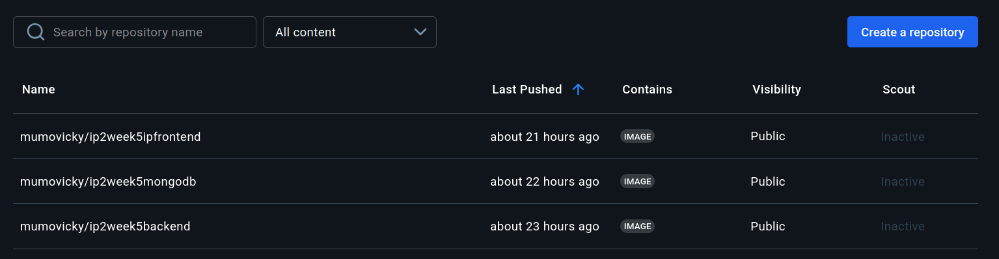

# E-Commerce Web Application
This project involves the use of Docker for containerization and deployment of the web application.

# Technologies


# Requirements
Install the docker engine here:
- [Docker Engine](https://docs.docker.com/engine/install/) (v20.10+)
- [Docker Compose](https://docs.docker.com/compose/install/) (v2.0+)
- 4GB RAM minimum (8GB recommended)

## How to launch the application 
1. **Clone the Repositoty you're in**:
    ```bash
    git clone https://github.com/Mumo-vicky/week5ip2.git
    cd yolomy

2. **Launch the application**
    ```bash
    docker-compose up -d

3. **Access the application**
    Frontend: http://localhost:3000
    Backend: http://localhost:5000

## Pre-Built Docker images on Dockerhub


**Ensure ports 3000,5000 and 27017 are all available**

