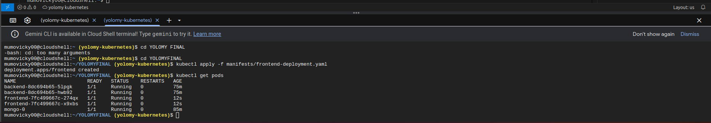
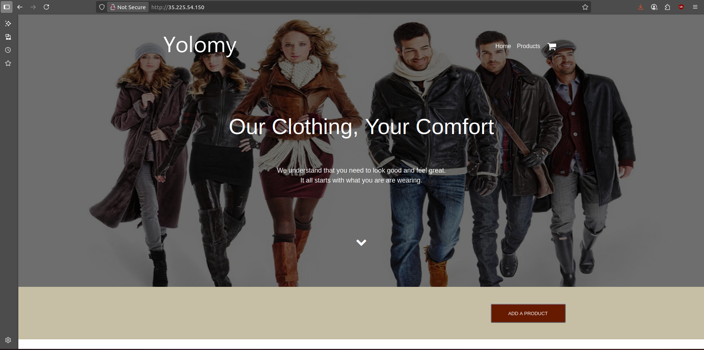

# **Kubernetes Week 5 Project - Application Deployment on GKE**

## **Project Overview**
This project demonstrates the deployment of a multi-container application on Google Kubernetes Engine (GKE) using Kubernetes orchestration concepts. The implementation includes StatefulSets for database persistence, Deployments for stateless services, and proper network exposure strategies.

### **Key Features**

✅ **Frontend** (React) – Served publicly via a **LoadBalancer**  
✅ **Backend** (Node.js) – Connects to MongoDB via **ClusterIP Service**  
✅ **MongoDB** – Deployed as a **StatefulSet** with **persistent storage** 

### Live Application
The deployed application is accessible at:  
**[Live Link](http://35.225.54.150/) - http://35.225.54.150/**

## Project Structure
```
project-root/
│
├── manifests/
│   ├── backend-deployment.yaml
│   ├── backend-service.yaml
│   ├── frontend-deployment.yaml
│   ├── frontend-service.yaml
│   ├── mongo-statefulset.yaml
│   ├── mongo-service.yaml
└── ...
```

## Prerequisites
- Google Cloud account with GKE enabled
- Docker installed

## Deployment Instructions

### 1. Set Up GKE Cluster
```bash
gcloud container clusters create yolomy-kubernetes \
  --zone us-central1-a \
  --machine-type e2-medium \
  --num-nodes 2 \
  --tags=web-server
  ```
### 2. Configure kubectl
```
gcloud container clusters get-credentials [CLUSTER_NAME] --zone [COMPUTE_ZONE]
```
### 3. Build and Push Docker Images
```
//Building Docker images
docker build -t mumovicky/yolomy-backend:v1.0.6 -f backend/Dockerfile .
docker build -t mumovicky/yolomy-frontend:v1.0.6 -f client/Dockerfile .
//Pushing docker images
docker push mumovicky/yolomy-frontend:v1.0.6
docker push mumovicky/yolomy-backend:v1.0.5
```
***Mongo DB image will be created by deployment file***
### 4. Deploy to GKE
```
kubectl apply -f manifests/
```
Verify pods:


Sample view of E-Commerce website:


