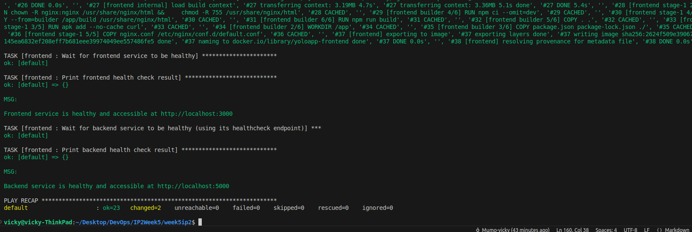

# YOLOMY E-Commerce Deployment with Vagrant & Ansible

## Project Overview
This project demonstrates a complete e-commerce application deployed using:
- **Vagrant** for VM provisioning
- **Ansible** for configuration management
- **Docker** for containerization


The below will be the tests to confirm the application is working correctly:
- Successfull rendition of web application page
- Successfull addition of a product
- Successfull retrieval of added products

These will test correct containerization, correct network connectivity and data persistence throughout the containers.

## Project Structure
```
project-root/
│
├── ansible/
│   ├── ansible-playbook.yml # Main Ansible playbook
│   ├── group_vars/
│   │ └── all.yml # Global variables
│   └── roles/
│       ├── backend_container/ # Node.js backend configuration
│       ├── clone/ # Code repository setup
│       ├── common/ # Base system setup
│       ├── docker/ # Docker installation
│       ├── mongodb/ # MongoDB container config
│       ├── frontend/ # React frontend configuration and final Docker Compose management
│
├── backend/                       # Node.js API source
│   ├── Dockerfile
│   └── ...
│
├── client/                        # React frontend source
│   ├── Dockerfile
│   ├── nginx.conf
│   └── ...
│
├── docker-compose.yml             # Container orchestration
├── Vagrantfile                    # VM configuration
└── README.md                      # This file
```
## Technology Stack

### 1. Vagrant
- Responsble for virtual machine provisioning
- Creates an Ubuntu 20.04 VM with:
  - 2GB RAM / 2 CPU cores
  - Port forwarding (3000, 5000, 27017)
  - Synced project folder

```ruby
Vagrant.configure("2") do |config|
  config.vm.box = "geerlingguy/ubuntu2004"

  config.vm.provider "virtualbox" do |vb|
     # Display the VirtualBox GUI when booting the machine
     # vb.gui = true

     # Customize the amount of memory on the VM:
     vb.memory = "2048"
     vb.cpus = 2
   end

config.vm.hostname = "yolomy"
  config.vm.network "forwarded_port", guest: 3000, host: 3000, host_ip: "127.0.0.1"
  config.vm.network "forwarded_port", guest: 5000, host: 5000, host_ip: "127.0.0.1"
  config.vm.network "forwarded_port", guest: 27017, host: 27017, host_ip: "127.0.0.1"

  config.vm.synced_folder ".", "/vagrant/yolo-app"

  config.vm.provision "ansible" do |ansible|
  ansible.playbook = "ansible/ansible-playbook.yml"
end
```
### 2. Ansible
- Responsible for configuration management
- Automates the below:
  -   Docker & Docker Compose installation
  -   Application deployment
  -   Container management

```yml
- name: Provision Vagrant VM and Deploy YOLOMY Application
  hosts: all
  become: yes

  roles:
    - role: common
    - role: docker
    - role: clone
    - role: mongodb
    - role: backend
    - role: frontend
```
### 3. Docker
- Responsible for containerization
-   MongoDB container (port 27017)
-   Node.js backend (port 5000)
-   React frontend via Nginx (port 3000)
```yml

services:
  frontend:
    build: client
    ports:
      - "3000:80"
    networks:
      - ipnet

  backend:
    build: backend
    ports:
      - "5000:5000"
    volumes:
      - yolomy-uploads:/usr/src/app/public/images
    networks:
      ipnet:
        aliases:
          - ipbackend
          - backend

  mongodb:
    image: mongo:6
    ports:
      - "27017:27017"
    volumes:
      - yolomy-data:/data/db
    networks:
      - ipnet

volumes:
  yolomy-data:
  yolomy-uploads:

networks:
  ipnet:
    driver: bridge
```
# Web Application Deployment

### 1. Vagrant Virtual Machine Provisioning
Run the commands:
```
vagrant up
# vagrant reload --if needed
vagrant provision
```




### 2. Ansible Execution
The vagrant file should execute the ansible playbook and once done, containers should be created sucessfully as below:


### 3. Application access and testing
The application should now be accessible on: http://localhost:3000

## Key Features
-   **Isolated Development Environment**: Vagrant ensures consistency across all team members' machines
-   **Automated Provisioning**: Ansible handles all setup tasks
-   **Containerized Services**: Docker provides clean separation of components
-   **Persistent Data**: Docker volumes maintain database and uploads between restarts


#### Application Screenshots


